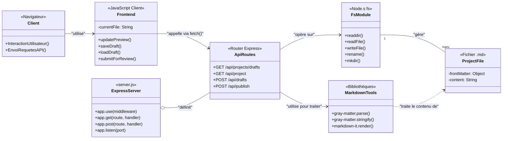

# Diagramme de Classes

Ce diagramme illustre les principaux composants de l'application BluePrint et leurs interactions.

### Description des Composants

*   **Client**: Le navigateur web de l'utilisateur qui accède à l'application.
*   **Frontend**: Le code JavaScript (`editor.js`, `preview.js`) qui s'exécute dans le navigateur pour gérer l'interface, la logique de l'éditeur et les appels à l'API.
*   **ExpressServer**: Le serveur Node.js principal (`server.js`) qui exécute l'application, sert les fichiers statiques et gère les routes.
*   **ApiRoutes**: Les points de terminaison de l'API définis dans le serveur pour gérer les projets (créer, lister, publier).
*   **FsModule**: Le module `fs` (File System) de Node.js, utilisé par le serveur pour lire et écrire les fichiers de projet sur le disque.
*   **MarkdownTools**: Les bibliothèques `gray-matter` et `markdown-it` utilisées pour analyser (parser) et générer les fichiers au format Markdown avec Front Matter.
*   **ProjectFile**: Représente un fichier de projet (`.md`) sur le disque, contenant les métadonnées (Front Matter) et le contenu principal.