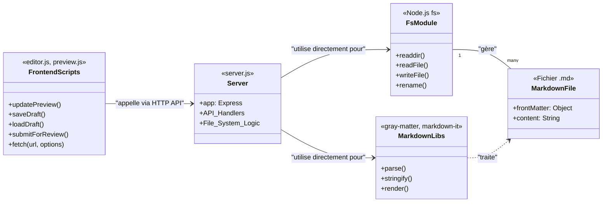

# Diagramme de Classes : État Actuel de l'Application

Ce diagramme représente l'architecture actuelle de l'application BluePrint. La logique est principalement procédurale et centrée autour du serveur Express et des scripts côté client. Il n'y a pas de classes formelles dans le code source, les "classes" ci-dessous représentent donc des modules ou des entités conceptuelles.

### Analyse de la Structure Actuelle

*   **Logique Centralisée dans `server.js`**: Comme le montre le diagramme, la classe `Server` (représentant `server.js`) est au cœur de toute la logique backend. Elle gère à la fois les routes de l'API, le traitement des requêtes et les interactions directes avec le système de fichiers (`fs`) et les bibliothèques Markdown.
*   **Couplage Fort**: Il y a un couplage fort entre la logique de l'API et la logique de persistance. Un changement dans la manière dont les fichiers sont stockés (par exemple, en passant à une base de données) nécessiterait des modifications importantes dans `server.js`.
*   **Frontend Actif**: Les `FrontendScripts` (`editor.js`, etc.) contiennent une logique importante pour interagir avec l'utilisateur et communiquer avec le backend.
*   **Pas de Modèles de Données Formels**: Le concept de "Projet" ou d'"Utilisateur" n'existe pas en tant qu'objet ou classe structurée dans le code backend. Les données sont traitées comme des objets JSON génériques et du texte.

Cette structure est fonctionnelle pour une application simple, mais elle est moins maintenable et évolutive que l'architecture que vous avez proposée. Votre diagramme introduit une séparation des responsabilités claire qui est absente ici.