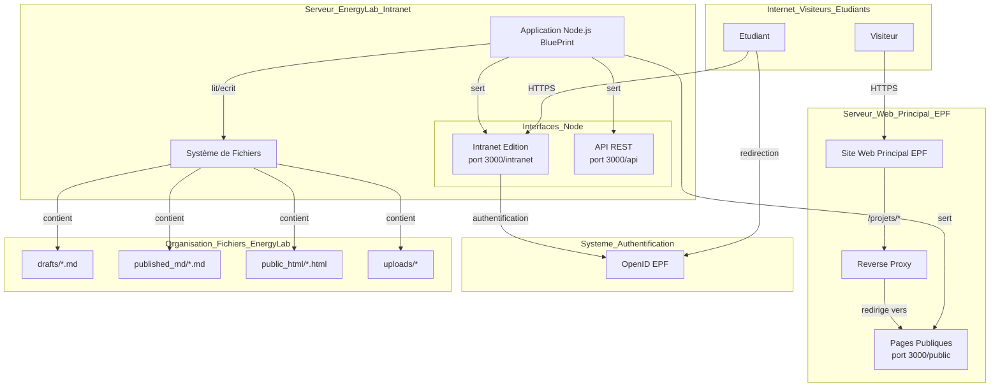

# Diagramme de Déploiement sur le Serveur EnergyLab

Ce document schématise l'architecture de déploiement de l'application BluePrint sur le serveur EnergyLab de l'EPF.

L'hypothèse principale est que le serveur EnergyLab héberge l'application Node.js (qui sert l'intranet et l'API) et que le site public principal de l'école est servi par un autre serveur web (par exemple, Apache ou Nginx), qui pourrait utiliser un reverse proxy pour intégrer les pages de projet.

### Description de l'architecture

1.  **Serveur EnergyLab :**
    *   C'est le cœur du système. Il exécute une seule application **Node.js**.
    *   Cette application est responsable de trois choses :
        *   Servir l'**Intranet d'Édition** (`/intranet`) aux étudiants authentifiés.
        *   Fournir l'**API REST** (`/api`) pour toutes les opérations (sauvegarder, publier, lister, etc.).
        *   Servir les pages **HTML statiques** des projets publiés (`/public`).
    *   L'application interagit directement avec le **système de fichiers** pour stocker les brouillons (`.md`), les archives publiées (`.md`), les pages de projet finales (`.html`) et les images téléversées.

2.  **Serveur Web Principal de l'EPF :**
    *   Ce serveur héberge le site web principal de l'école.
    *   Pour que les projets soient accessibles de manière transparente (par exemple, `ecole.epf.fr/projets/mon-projet`), il est probable qu'un **reverse proxy** soit configuré.
    *   Ce reverse proxy redirigerait toutes les requêtes commençant par `/projets/` vers l'application Node.js sur le serveur EnergyLab (spécifiquement vers la partie `/public`).

3.  **Flux des Utilisateurs :**
    *   Les **Visiteurs** accèdent aux projets via le site web principal de l'EPF.
    *   Les **Étudiants** se connectent directement à l'intranet servi par l'application Node.js sur EnergyLab. L'authentification est déléguée au fournisseur **OpenID** de l'école.
