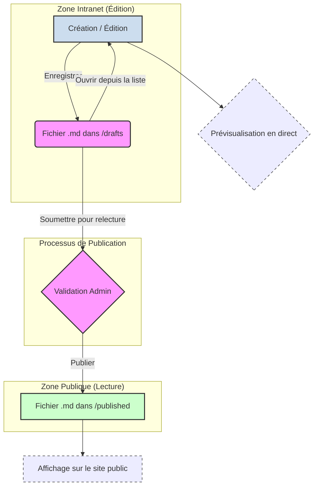

# Schéma de la Chaîne de Traitement des Données (Projet)

Ce schéma illustre le cycle de vie d'un projet, depuis sa création jusqu'à sa publication. Il met en évidence les différentes étapes et les actions qui font passer un projet d'un état à un autre.

### Description des États et Transitions

1.  **Création / Édition (A)**: L'utilisateur remplit les champs du formulaire dans l'éditeur de l'intranet. Pendant cette phase, une **prévisualisation (E)** est affichée en temps réel.
2.  **Brouillon (B)**: En cliquant sur "Enregistrer", le contenu est sauvegardé sous forme de fichier Markdown (`.md`) dans le dossier `blueprint_local/intranet/projects/drafts`. Ce brouillon peut être rechargé à tout moment pour continuer l'édition.
3.  **Validation Admin (C)**: Lorsque l'utilisateur clique sur "Soumettre pour relecture", le projet est déplacé vers une zone de validation (`blueprint_local/admin/projects/pending` - *Note: cette étape est conceptuelle, l'implémentation actuelle déplace directement vers `published`*). Un administrateur peut alors relire le projet.
4.  **Publié (D)**: Après validation, le fichier est déplacé dans le dossier `blueprint_local/public/projects/published`.
5.  **Affichage Public (F)**: Les fichiers présents dans le dossier `published` sont lus par le serveur pour être affichés sur le site public.