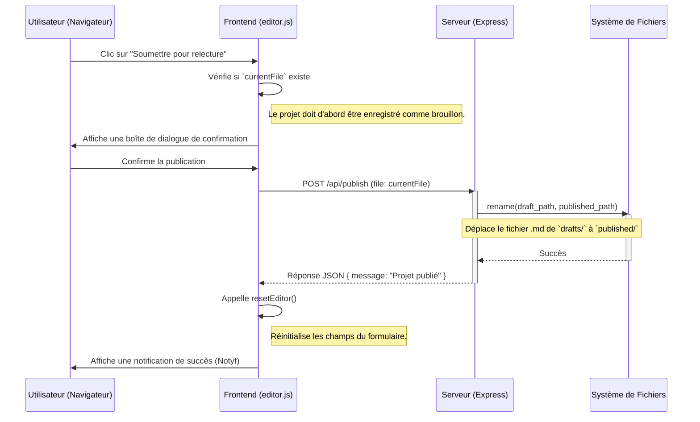

# Diagramme de Séquence : Publication d'un Projet

Ce diagramme montre la séquence des événements qui se produisent lorsqu'un utilisateur publie un projet.

### Description des Étapes

1.  **Action Utilisateur**: L'utilisateur clique sur le bouton "Soumettre pour relecture" dans l'interface de l'éditeur.
2.  **Confirmation**: Le script `editor.js` demande une confirmation à l'utilisateur avant de procéder.
3.  **Appel API**: Une fois la confirmation obtenue, le frontend envoie une requête `POST` à l'endpoint `/api/publish` du serveur, en précisant le nom du fichier à publier.
4.  **Traitement Serveur**: Le serveur reçoit la requête et utilise le module `fs` de Node.js pour déplacer le fichier du répertoire des brouillons (`drafts`) vers le répertoire des projets publiés (`published`).
5.  **Réponse Serveur**: Le serveur renvoie une réponse de succès au format JSON.
6.  **Mise à jour du Frontend**: Le script `editor.js` reçoit la réponse, affiche une notification de succès à l'utilisateur et réinitialise l'éditeur pour permettre la création d'un nouveau projet.