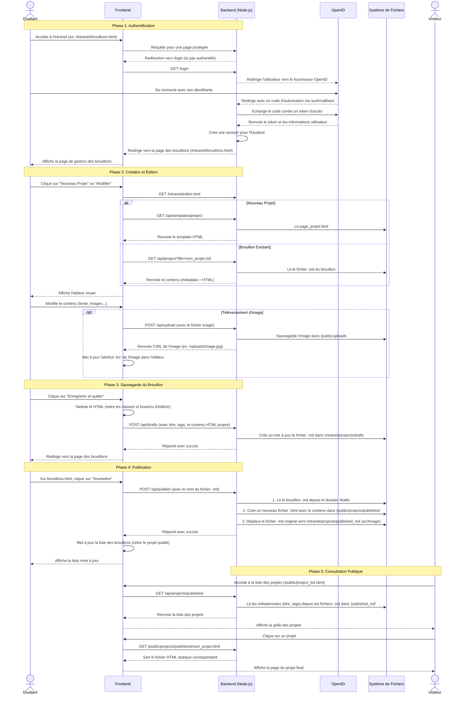

# Workflow de l'Authentification à la Publication d'un Projet

Ce document décrit le parcours complet d'un projet, depuis la connexion de l'étudiant jusqu'à sa publication et sa consultation sur le site public.

